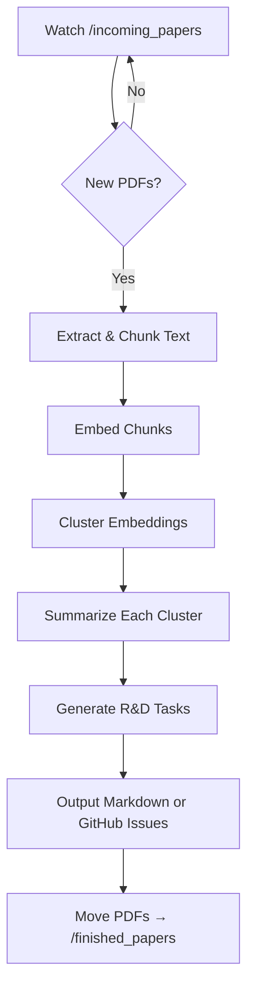
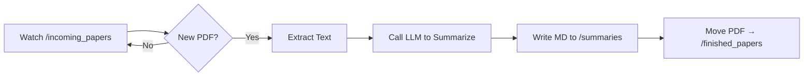
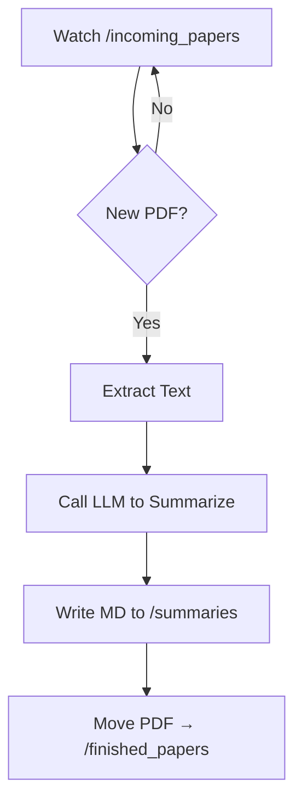

# AI-Agents

```mermaid
flowchart TD
  A[Watch /incoming_papers] --> B{New PDFs?}
  B -- Yes --> C[Extract & Chunk Text]
  C --> D[Embed Chunks]
  D --> E[Cluster Embeddings]
  E --> F[Summarize Each Cluster]
  F --> G[Generate R&D Tasks]
  G --> H[Output Markdown or GitHub Issues]
  H --> I[Move PDFs → /finished_papers]
  B -- No --> A
```

## AI Assistant for Research Papers

this is the readme file

## Overview (old)

```mermaid
  graph LR
  A[Watch /incoming_papers] --> B{New PDF?}
  B -- Yes --> C[Extract Text]
  C --> D[Call LLM to Summarize]
  D --> E[Write MD to /summaries]
  E --> F[Move PDF → /finished_papers]
  B -- No --> A
```

```mermaid
flowchart TD
  A[Watch /incoming_papers] --> B{New PDF?}
  B -- Yes --> C[Extract Text]
  C --> D[Call LLM to Summarize]
  D --> E[Write MD to /summaries]
  E --> F[Move PDF → /finished_papers]
  B -- No --> A
```
