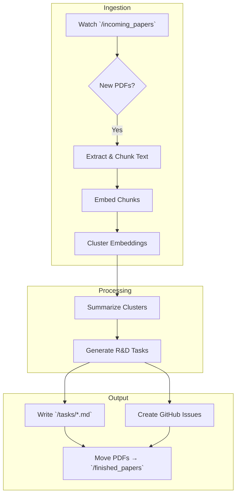

# Research-to-Task Agent: Detailed Implementation Plan

---

## 1. Project Overview

**Name:** Research-to-Task Agent  
**Objective:**

- Ingest new PDFs from a designated folder
- Cluster related content into themes
- Summarize each theme’s insights
- Auto-generate prioritized R&D tasks
- Export tasks as Markdown or GitHub Issues

---

## 2. Directory Structure

```plaintext
research-to-task-agent/
├── .gitignore                 # Git ignore rules (e.g., `.env`, `__pycache__`, `logs/`)
├── .env                       # Environment variables (API keys, folder paths)
├── README.md                  # Project overview, setup & usage instructions
├── requirements.txt           # Python dependencies (`watchdog`, `pdfminer.six`, `openai`, etc.)
├── Dockerfile                 # Container definition for deployment
│
├── agent.py                   # Main entrypoint: orchestrates watcher → processing → output
│
├── config/
│   └── config.py              # Loads `.env` and exposes constants (paths, API keys)
│
├── src/                       # Core modules
│   ├── watcher.py             # Folder-watcher logic (`incoming_papers` → events)
│   ├── extractor.py           # PDF → raw text extraction & chunking
│   ├── embedder.py            # Wrappers for OpenAI embedding API
│   ├── clusterer.py           # Clustering logic (KMeans or HDBSCAN)
│   ├── summarizer.py          # LLM prompts for cluster summaries
│   ├── task_generator.py      # LLM prompts for R&D task generation
│   └── output.py              # Writes Markdown tasks or creates GitHub Issues
│
├── tests/                     # Unit tests for each component
│   ├── test_watcher.py        # Tests folder detection & event debouncing
│   ├── test_extractor.py      # Tests PDF extraction & chunk integrity
│   ├── test_clustering.py     # Tests embedding + cluster assignments
│   └── test_output.py         # Tests Markdown/GitHub output idempotency
│
├── incoming_papers/           # Watched folder for newly dropped PDF files
├── finished_papers/           # Archive for PDFs after successful processing
├── tasks/                     # Generated Markdown files per theme/cluster
│
├── logs/                      # Runtime logs for ingestion & processing
│   └── agent.log              # Daily rotating log file
│
└── .github/
    └── workflows/
        └── ci.yml            # CI pipeline: lint, tests, build Docker image
```

## 2. System Architecture


